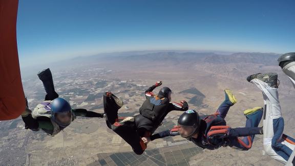
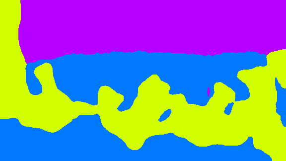
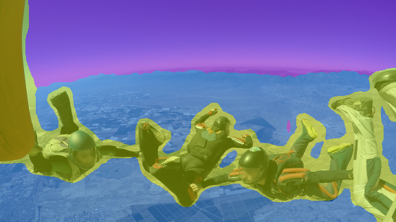

# DeepLabV3FineTuning
Semantic Segmentation : Multiclass fine tuning of DeepLabV3 with PyTorch

The code in this repository performs a fine tuning of DeepLabV3 with PyTorch for multiclass semantic segmentation.

## Result Preview
Random result on a test image (not in dataset) </br>


## Requirements
Basic dependencies are PyTorch 1.4.0 and torchvision 0.5.0.</br>
I used a conda virtual env, where I installed the following packages :
```bash
conda install -c conda-forge -c pytorch python=3.7 pytorch torchvision cudatoolkit=10.1 opencv numpy pillow
```

## Dataset
I created a dataset from my own personal skydiving pictures.</br>
Around 500 images were gathered and annotated using the excellent tool CVAT : https://github.com/opencv/cvat </br>
</br>
/!\ On this repo, I only uploaded a few images in  as to give an idea of the format I used.</br>
I wrote a  to easily convert one of the XML export types (LabelMe ZIP 3.0 for images) of CVAT into label images</br>
There are 5 classes in my example: <br/>
* No-label : 0
* Person : 1
* Airplane : 2
* Ground : 3
* Sky : 4

## How to run training
Once you replace sample_data with your own dataset :
```bash
python sources/main_training.py ./sample_dataset ./training_output --num_classes 5 --epochs 100 --batch_size 16 --keep_feature_extract
```
Best value I obtained were Loss: 0.2066 and Accuracy: 0.8099 with 100 epochs
The accuracy is computed as the mean of the IoU (Intersection-over-Union) for all classes.

## Step by step
### Model
First thing is to fetch a pretrained DeepLabV3 model. <br/>
It is pretrained on a subset of COCO train2017, on the 20 categories that are present in the Pascal VOC dataset.
```python
model_deeplabv3 = models.segmentation.deeplabv3_resnet101(pretrained=use_pretrained, progress=True)
```
The auxiliary classifier is removed, and the pretrained weights are frozen.
```python
model_deeplabv3.aux_classifier = None
for param in model_deeplabv3.parameters():
    param.requires_grad = False
```
The pretrained classifier is replaced by a new one with a custom number of classes. Since it comes after the freeze, its weights won't be frozen. They are the ones that we will fine-tune. 
```python
model_deeplabv3.classifier = torchvision.models.segmentation.deeplabv3.DeepLabHead(2048, num_classes)
```
### Data Augmentation
Following data augmentation are applied to the training set :
```python
self.transforms = transforms.Compose([
    transforms.RandomHorizontalFlip(),
    transforms.RandomVerticalFlip(),
    transforms.RandomCrop((224, 224)),
    transforms.ToTensor(),
    transforms.Normalize([0.485, 0.456, 0.406, 0], [0.229, 0.224, 0.225, 1])
])
```
For the validation set, only centered crop and normalization are applied :
```python
self.transforms = transforms.Compose([
    transforms.CenterCrop((224, 224)),
    transforms.ToTensor(),
    transforms.Normalize([0.485, 0.456, 0.406, 0], [0.229, 0.224, 0.225, 1])
])
```
To ensure that the same transformation is applied on the input image and the expected output label image, both of them are merged into a 4 channels image prior to transformation. They are then split back as two separate entities for the training.<br/>
```python
image = Image.open(img_path)
label = Image.open(label_path)

# Concatenate image and label, to apply same transformation on both
image_np = np.asarray(image)
label_np = np.asarray(label)
new_shape = (image_np.shape[0], image_np.shape[1], image_np.shape[2] + 1)
image_and_label_np = np.zeros(new_shape, image_np.dtype)
image_and_label_np[:, :, 0:3] = image_np
image_and_label_np[:, :, 3] = label_np

# Convert to PIL
image_and_label = Image.fromarray(image_and_label_np)

# Apply Transforms
image_and_label = self.transforms(image_and_label)

# Extract image and label
image = image_and_label[0:3, :, :]
label = image_and_label[3, :, :].unsqueeze(0)
```

### Training
The chosen training loss is Cross Entropy (https://pytorch.org/docs/stable/nn.html#crossentropyloss) since it is well suited for multiclass classification problems.<br/>
```python
# Setup the loss function
criterion = nn.CrossEntropyLoss(weight=(torch.FloatTensor(weight).to(device) if weight else None))
```
The optimizer is SGD with a learning rate of 0.001 and a momentum of 0.9.<br/>
Only the classifier parameters are optimized.<br/>
```python
params_to_update = []
for name, param in model_deeplabv3.named_parameters():
    if param.requires_grad:
        params_to_update.append(param)
optimizer_ft = optim.SGD(params_to_update, lr=0.001, momentum=0.9)
```
